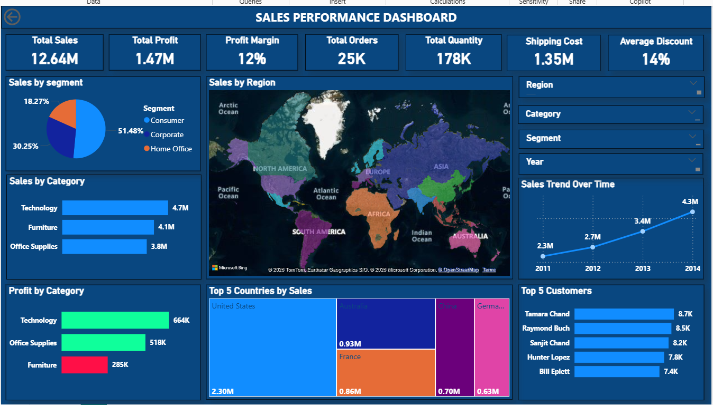
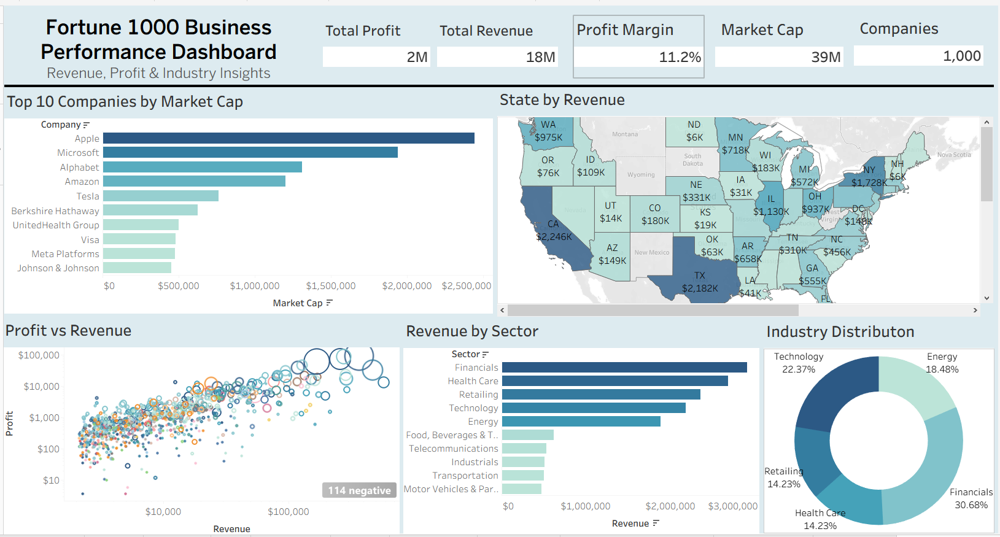
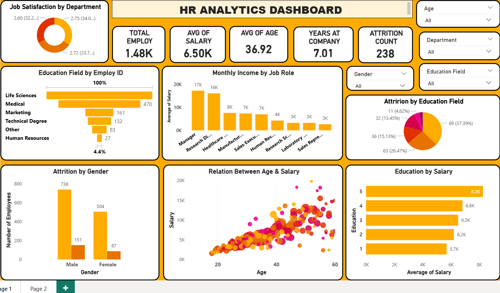
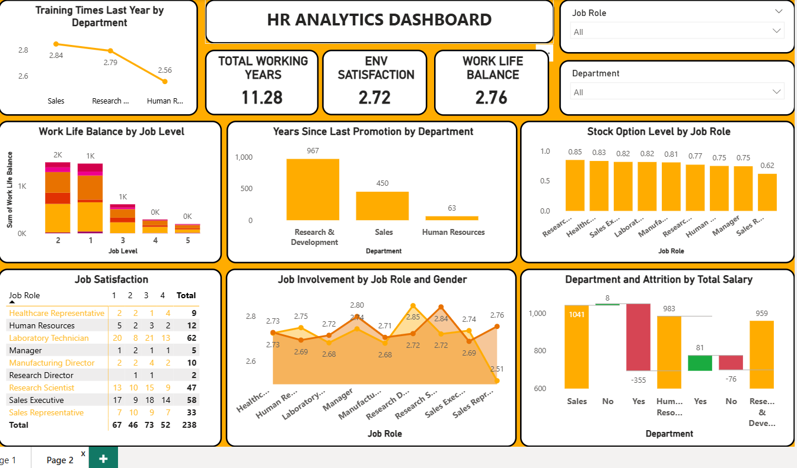

# 👩‍💻 Gausiya Khan | Data Analyst Portfolio

📍 Nashik, Maharashtra, India
📞 +91 8087349525
✉️ gausiya.firdous@gmail.com
🔗 [LinkedIn](https://linkedin.com/in/gausiya-firdous-khan)

## About Me
Ambitious and detail-driven Data Analyst with hands-on experience in Python, Power BI, and Tableau for end-to-end data cleaning, analysis, and visualization. Passionate about uncovering actionable insights from complex datasets.
## 🛠️ Technical Skills

| Category | Tools |
|----------|-------|
| Programming | Python, Pandas, NumPy, SQL |
| Visualization | Power BI, Tableau, Matplotlib |
| Database | PostgreSQL |SQL|
| Spreadsheets | Microsoft Excel |
| Statistics | Descriptive, Inferential, Basic ML |
## 📊 Projects

### Project 1: Sales Performance Dashboard
🛠️ Tools: Power BI
- Interactive dashboard analyzing global sales across regions and categories
- KPI cards, trend charts, drill-through visuals
- Identified top products and underperforming regions

 
  
### Project 2: Fortune 1000 Business Intelligence Dashboard
🛠️ Tools: Tableau, Pandas
- Visualized financial metrics of Fortune 1000 companies
- Advanced filters, parameters, and calculated fields
- Cleaned missing values and handled inconsistencies
- Converted data types for accurate analysis
- Prepared a structured dataset for visualization

  

  ### Project 3: HR Analytics Dashboard
🛠️ Tools: Power BI
- Analyzed employee attrition rates and workforce metrics
- Identified key factors impacting attrition

  
  
  
### Project 4: Oral Cancer Prediction
🛠️ Tools: Python, Pandas, Matplotlib, Machine Learning
- ML model to predict oral cancer risk
- Data preprocessing, EDA, and feature engineering

### Project 5: Titanic Survival Analysis
🛠️ Tools: Python, NumPy, Pandas, Matplotlib
- EDA on Titanic dataset
- Analyzed survival patterns by gender, age, class
  
### Project 6: Excel-Based Sales & Profit Analysis
🛠️ Tools: Microsoft Excel
- Pivot Tables, VLOOKUP, IF formulas
- Dynamic charts and weekly/monthly summaries

  

### Project 7: Hospital Management System
🛠️ Tools: PostgreSQL, SQL
- Relational database for hospital operations
- Complex joins, aggregations, subqueries

## 🏆 Certification
**Data Analytics Certification**
EasySkill Career Academy, Surat | 2026
- Python, SQL, Power BI, Tableau, Advanced Excel,ML, Data Visualaization
- End-to-end EDA and dashboard development

  ## 🎓 Education
- M.A. | Sant Gadge Baba Amravati University | 2017
- B.A. | Sant Gadge Baba Amravati University | 2015

⭐ *If you find my work interesting, please star this repository!*
